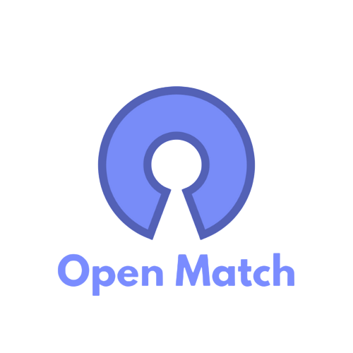

# OpenMatch

**Uma plataforma open-source que ajuda novos desenvolvedores a encontrarem suas primeiras contribuições, agregando issues para iniciantes de todo o GitHub.**

## Sobre o Projeto

Encontrar a primeira issue para contribuir em um projeto open-source pode ser uma tarefa difícil e intimidante. O OpenMatch nasceu para resolver esse problema, criando um ambiente centralizado e amigável que busca e exibe ativamente issues marcadas como "boas para iniciantes" (como `good first issue`, `help wanted`, etc.), oferecendo um ponto de partida claro para novos contribuidores.

## Funcionalidades Principais

- **Busca Automática:** Um serviço de crawler busca novas issues para iniciantes a cada hora.
- **Status Atualizado:** As issues são validadas a cada 6 horas para garantir que apenas as vagas abertas sejam exibidas.
- **Interface Limpa:** Um frontend moderno e rápido construído com Next.js para visualizar e filtrar as vagas.
- **Totalmente Open Source:** Contribua, modifique e hospede sua própria instância.

## Stack Tecnológica

A plataforma é dividida em três componentes principais:

| Componente | Tecnologia  | Propósito                                               |
| :--------- | :---------- | :------------------------------------------------------ |
| `crawler`  | **Go**      | Busca novas issues de iniciantes via API do GitHub.     |
| `updater`  | **Go**      | Atualiza o status (aberta/fechada) das issues no banco. |
| `frontend` | **Next.js** | Exibe as issues para o usuário final.                   |

### Pré-requisitos

- [Go](https://golang.org/doc/install) (versão 1.24 ou superior)
- [Node.js](https://nodejs.org/) (versão 20 ou superior)
- [Yarn](https://yarnpkg.com/) ou npm
- Um token de acesso pessoal do GitHub com escopo `public_repo`. [Como criar um](https://docs.github.com/en/authentication/keeping-your-account-and-data-secure/creating-a-personal-access-token).
- Banco de dados PostgreSQL instalado e configurado.

## Como Contribuir

Contribuições são o que tornam a comunidade de código aberto um lugar incrível para aprender, inspirar e criar. Qualquer contribuição que você fizer será **muito apreciada**.

1.  Leia nosso **[Guia de Contribuição](https://github.com/andretimm/openmatch/blob/main/CONTRIBUTING.md)** para entender nosso fluxo de trabalho.
2.  Verifique as **[issues abertas](https://github.com/andretimm/openmatch/issues)**. As marcadas com `good first issue` são ótimas para começar\!
3.  Siga nosso **[Código de Conduta](https://github.com/andretimm/openmatch/blob/main/CODE_OF_CONDUCT.md)** para garantir uma comunidade respeitosa.

## Licença

Distribuído sob a Licença MIT. Veja `LICENSE` para mais informações.

## Contato

André Timm - andretimm2012@gmail.com
